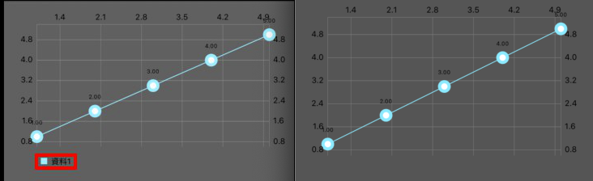

# Lesson1 Chart Setup

範例：[https://github.com/cmmobile/WWChartsDemo](https://github.com/cmmobile/WWChartsDemo)

本篇以LineChart為範例，基本上適用於一般常用Chart圖\(Bar, Combine, Scatter\)

圖表無資料設定

```swift
chart.noDataFont = UIFont.boldSystemFont(ofSize: 20)
chart.noDataText = "圖表無資料"
chart.noDataTextColor = .white
```


接著我們先塞一點資料進去，不過本篇重點不在圖表資料所以先忽略不講

一開始會看到醜醜的圖


接下來要一步步更改外觀

### 1.關閉圖示 \(在籌碼K一般不使用內建的legend

```swift
chart.legend.enabled = false
```



### 2.x軸設定

```swift
let xAxis = chart.xAxis
xAxis.labelPosition = .bottom
```

設定labelPosition 在籌碼K   x軸常會來顯示時間 會把它放在下面


```swift
xAxis.labelCount = 6
xAxis.labelTextColor = .white
xAxis.labelFont = UIFont.systemFont(ofSize: 10)
//xAxis.drawLabelsEnabled = true
```

字的風格


與label的分隔線

```swift
xAxis.axisLineColor = .yellow
//xAxis.drawAxisLineEnabled = true
//xAxis.axisLineWidth = 0.5

xAxis.drawGridLinesEnabled = false
xAxis.axisMinimum = -0.5
```


與xAxis相依的值切線

```text
xAxis.gridColor = .red
//xAxis.drawGridLinesEnabled = true
//xAxis.gridLineWidth = 0.5
```


畫面顯示的最大最小x設定\(自己指定 不交給charts去運算

```text
xAxis.axisMinimum = -10
xAxis.axisMinimum = 10
```


### 3.y軸的設定

依照上面的圖表 我們可以看到 左邊跟右邊都有數字Label

而Charts裡面是可以放入兩種Data去分別依賴左右兩邊的Value


接下來的設定就跟X軸一樣，有Label、GridLine、AxisLine

而axisMinimum通常會給Charts自己去算，預設上下會留10%空間。

