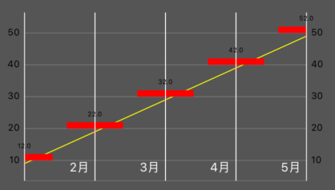
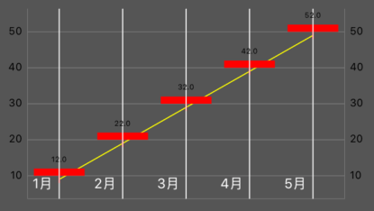
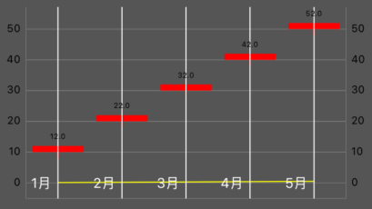
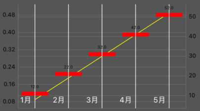

# Lesson3 CombinedChartView

範例：[https://github.com/cmmobile/WWChartsDemo](https://github.com/cmmobile/WWChartsDemo)

一般用到K線圖得地方 都會需要參考線

使用CombinedChartView實作

```swift
@IBOutlet weak var chart: CombinedChartView!
```

只要照之前步驟多生產一個LineChartData即可實作出來

```swift
private func getLData() -> LineChartData {
    var enties: [ChartDataEntry] = []
    for (i, data) in lineDatas.enumerated() {
        let e = ChartDataEntry(x: Double(i), y: data.price)
        enties.append(e)
    }
    let set1 = setLDataSet(enties: enties)
    let cData = LineChartData(dataSet: set1)
    return cData
}

private func setLDataSet(enties: [ChartDataEntry]) -> LineChartDataSet {
    let dataset = LineChartDataSet(entries: enties, label: nil)
    dataset.colors = [.yellow]
    dataset.drawCirclesEnabled = false
    dataset.drawValuesEnabled = false
    return dataset
}
```

```swift
private func setData() {
    let data = CombinedChartData()
    data.candleData = getCData()
    data.lineData = getLData()
    chart.data = data
}
```



### 圖表優化

由圖1可以看出CombinedChartView 的x軸自動設定把 第一及最後的K線吃掉了，解決方法是自訂x的上下邊界

最小值

```swift
chart.xAxis.axisMinimum = -0.5
```

最大值

```swift
chart.xAxis.axisMaximum = Double(lineDatas.count) - 0.5
```

最大值會由資料的根數去決定



### axisDependency介紹

有時會遇有兩種圖單位差距很大放在同一張表的需求\(例如:股價與殖利率\)

這時就需要讓兩張圖的依附值分別在不同邊

這邊直接把剛剛的線圖除以100來做案例

```swift
for i in 1...5 {
    let number = Double(i) * 10
//            let data = LineData(time: "\(i)月", price: number - 1)
    
    //axisDependency介紹
    let data = LineData(time: "\(i)月", price: (number - 1)/100)
    datas.append(data)
}
```



沒有處理的狀況下如圖2,導致沒辦法看出另一張圖的曲線

此時只要將兩種data set分別依附在左右不同邊即可以用較好的方式呈現這兩種數據

```swift
let dataset = LineChartDataSet(entries: enties, label: nil)
        dataset.axisDependency = .left
        
        -------
        
let dataset = CandleChartDataSet(entries: enties, label: nil)
        dataset.axisDependency = .right
```



