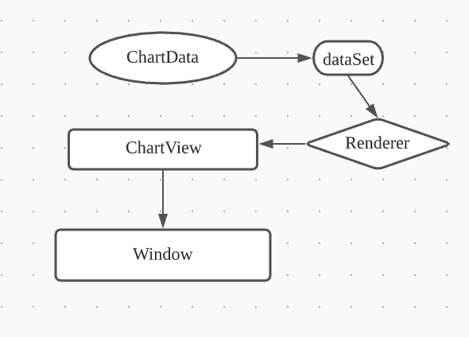
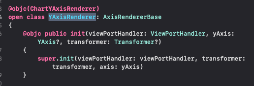

# Lesson4 Renderer

範例：[https://github.com/cmmobile/WWChartsDemo](https://github.com/cmmobile/WWChartsDemo)

本篇已LineChartView 客制 yAxis 為例子，所有圖表的客制都大同小異，複寫之前先調出該類的Renderer就可以看出ㄧ二。

`本篇會假設你已經在專案中安裝Charts並了解 Charts 的基本繪製，自少已經了解 LineChartView上面的每個組件是什麼，以及基本的UIView底層運作`

##### Renderer 是什麼

開始之前，我們先暸解一下Renderer (宣染器)是什麼。
已 UIView 為例子，一個繼承UIView的元件，在呈現畫面之前會調用 draw(_ rect:) 繪製，而draw 就是UIView的 Render。
而Renderer 顧名思義就是負責 ChartView 的繪製工作，即是個 ViewModer。

在之前章節我們有試著畫出一些基本圖表，在繪製之前我們做了些動作，如下：
<pre><code>var enties = [LineChartDataEntry]()
var dataSet = LineChartDataSet(entries: enties)
var chartData = LineChartData(dataSet: dataSet)
chartView.data = chartData
</code></pre>

簡單設定了數據，後續的工作都是Renerder在作業。

- - -
##### 接著我們會試著客制Y軸標籤

- Y值介於 0-100，黑色(字體顏色)
- Y值介於 101-200，紅色
- Y值介於 201-300，黃色
- Y值介於 301-400，藍色
- Y值介於 301-400，黑色

`先來簡單分析一下 YAxisRenderer (直接在 XCode中搜尋 YAxisRenderer) `

第一次看一定會很頭暈，不用擔心我也是這樣。
沒關係我會帶你很快的進入狀況。

###### 先來分析第一部分（如下圖）

\-分析\-
- AxisRendererBase 是 YAxisRenderer，依照命名可以很看出所有軸線的Render都繼承 AxisRendererBase。
- init 有三個參數 viewPortHandler / yAxis / transformer。
你可能會比較有興趣 transformer: transformer 內部是提供Y軸 CGAffineTransform 轉移陣列的方法，如果需要將圖表轉方向的話你會需要了解這條屬性。
但它今天不是我們的重點。

###### 第二部分

YAxisRenderer 類別內有很多很多的func，我們試著 com + F 找找關鍵字 Label，找到兩個 func 看來我們要找的就是他們了。
<pre><code>func renderAxisLabels(...){}
func drawYLabels(...) {}
</code></pre>

研究第一個 func renderAxisLabels(context: CGContext){} ，我發現在閉包末端呼叫了第二個func drawYLabels。
很明顯的 enderAxisLabels() 只是先做繪圖前置作業，如 Y軸偏移亮、標籤文字的TextAlignment、標籤相對位子等的準備。
有興趣的可以再仔細研究看看。

`我們拉到 drawYLabels() 解析一下它在做什麼 （建議看一下參數是什麼，這邊就不特別提到，都很好懂`

前半段很好懂，全部都是label相關屬性，直接跳到下半部的 for-in
<pre><code>for i in stride(from: from, to: to, by: 1)
    {
        let text = yAxis.getFormattedLabel(i)
            
        ChartUtils.drawText(context: context, text: text, point: CGPoint(x: fixedPosition + xOffset, y: positions[i].y + offset),
            align: textAlign, attributes: [.font: labelFont, .foregroundColor: labelTextColor])
    }
</code></pre>

看到一個新玩意: ChartUtils，看來它就是繪製整個圖表的底層的worker。

`ChartUtils: 接收所有繪圖所必要的屬性，用 UIGraphicsContext執行繪圖`

for- in 內，遍歷 stride(from: from, to: to, by: 1) 每一單位呼叫 drawText 繪圖，對照Y軸 就是一格一個label。 
知道原理後，我們只要在for-in迴圈內繪圖的前一刻，把數據顏色改成我們需要的就可以，既不會影響整個線圖的位子，改動的code最少也最安全。

##### 開始動工

先創建一個自定義的 Y軸子類別。

<pre><code>
class MyYAxis : YAxisRenderer {
    ...
}
</code></pre>

**再次確認需求**
- Y值介於 0-100，黑色(字體顏色)
- Y值介於 101-200，紅色
- Y值介於 201-300，黃色
- Y值介於 301-400，藍色
- Y值大於 400，黑色

**要做事情**
- 覆寫 drawYLabels()
 * 細一點，改寫 drawYLabels() For-in迴圈內的代碼

偷懶一點，我們從 YAxisRenderer 把整個 drawYLabels 原原本本的複製到 MyYAxis ，前面加上 override

<pre><code>
class MyYAxis : YAxisRenderer {
    override func drawYLabels(context: CGContext, fixedPosition: CGFloat, positions: [CGPoint], offset: CGFloat, textAlign: NSTextAlignment)
    {
        ...(太長就不附上)
        }
    }
}
</code></pre>

接下來依照需求我們寫一個簡單的判斷式，就寫最簡單的方法。

<pre><code>// 加上一個回圈。NSAttributedString 顏色改上自定義的 color 解決
    let color: UIColor
        if let value = Double(text) {
            if value > 0 &&  value <= 100 {
                color = .black
                  }else if  value > 100 &&  value <= 200 {
                     color = .red
                  }else if value > 201 &&  value <= 300 {
                     color = .systemYellow
                  }else if value > 300 && value <= 400{
                     color = .blue
                } else {
                    color = .black
                }
            }else { color = .black }
</code></pre>

把它貼在  let text = yAxis.getFormattedLabel(i) 後面，把context.drawText最後端的參數改成 color
<pre><code>for i in from..<to
    {
            let text = axis.getFormattedLabel(i)
            ...(貼在這)
            ChartUtils.drawText(text, at: CGPoint(x: fixedPosition + xOffset, y: positions[i].y + offset), align: textAlign, attributes: [.font: labelFont, .foregroundColor: color])
    }
</code></pre>

--