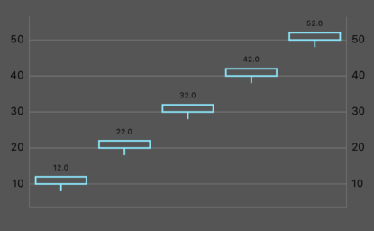
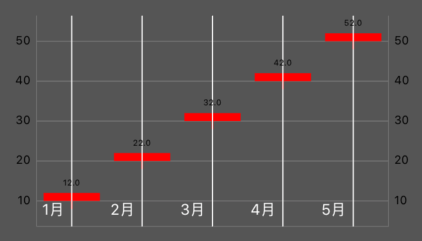

# Lesson2 Chart Data

範例：[https://github.com/cmmobile/WWChartsDemo](https://github.com/cmmobile/WWChartsDemo)

要建立Chart圖上的資料，此範例以建構出K線圖為目標來介紹。

### 1.建立Entry

```text
ChartDataEntry(x: 0, y: 1)
```

一般的線圖、Bar圖在圖面上皆是一個x一個y而k線圖則有開高低收這四個數字

```text
CandleChartDataEntry(x: 0, shadowH: 10, shadowL: 0, open: 0, close: 0)
```

建立模擬資料

```swift
private func setData() {
    var enties: [CandleChartDataEntry] = []
    for (i, data) in kDatas.enumerated() {
        let e = CandleChartDataEntry(x: Double(i), shadowH: data.high, shadowL: data.low, open: data.open, close: data.close)
        enties.append(e)
    }
    let set1 = CandleChartDataSet(entries: enties, label: nil)
    let data = CandleChartData(dataSet: set1)
    
    chart.data = data
}
```

一般大部分在公司的Chart X軸代表的都是日期

所以會拿index值直接放入x內再使用限制線去顯示日期



### 2.Entry轉換成DataSet

設定資料的樣式讓他有K線的樣子

```swift
private func setDataSet(enties: [CandleChartDataEntry]) -> CandleChartDataSet {
    let dataset = CandleChartDataSet(entries: enties, label: nil)
    dataset.decreasingColor = .green
    dataset.increasingColor = .red
    dataset.decreasingFilled = true
    dataset.increasingFilled = true
    dataset.shadowColorSameAsCandle = true
    return dataset
}
```


### 3.DataSet轉換成ChartData

這個步驟主要是有些Charts Data會放好幾個Dataset \(例如:多線圖\)

K線圖通常就一個Dataset就行了

```swift
let set1 = setDataSet(enties: enties)
let data = CandleChartData(dataSet: set1)
```

### 4.ChartData放入 Charts

```text
chart.data = data
```

### 5.補上日期

以同樣的資料源\(kDatas\)確保index\(ChartData x\)會對應到相同的kData，再從data裡面的時間字串去加上限制線

```swift
private func setDateLine() {
    for (i, info) in kDatas.enumerated() {
        addDateLimitLine(month: info.time, index: i)
    }
}

///增加限制線(月線)
private func addDateLimitLine(month: String, index: Int) {
    let monthLimitLine = ChartLimitLine(limit: Double(index), label: month)
    monthLimitLine.labelPosition = .bottomLeft
    monthLimitLine.lineWidth = 1
    monthLimitLine.lineColor = .white
    monthLimitLine.valueTextColor = .white
    chart.xAxis.addLimitLine(monthLimitLine)
}
```



