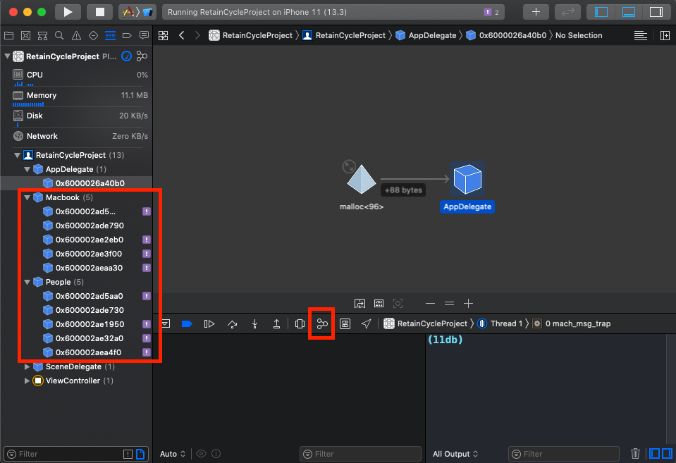

# ARC + Retain Cycle

## 課程文件

* 參考連結：
  * [Automatic Reference Counting](https://docs.swift.org/swift-book/LanguageGuide/AutomaticReferenceCounting.html)
  * [Swift Retain Cycle](https://ithelp.ithome.com.tw/articles/10196788)
* 範例連結：
  * [iOS\_RetainCycleProject](https://github.com/cmmobile/iOS_RetainCycleProject)

## 如何找Retain Cycle

### 方法一：使用 deinit，確認物件是否被消滅

```swift
/// 人物
class People {
    let name: String
    var macbook: Macbook?

    init(name: String, macbook: Macbook?) {
        self.name = name
        self.macbook = macbook
    }

    deinit {
        print("\(name) deinit.")
    }
}

/// 筆電
class Macbook {
    let name: String
    var owner: People? // <----- 必須加上weak才可以被釋放

    init(name: String, owner: People?) {
        self.name = name
        self.owner = owner
    }

    deinit {
        print("\(name) deinit.")
    }
}
```

### 方法二：使用 Xcode 的 Debug Memory Graphic



