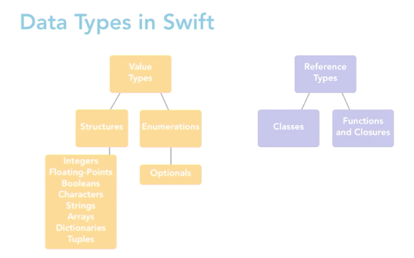

# Value / Reference Type

## 三種記憶體區間


#### 1. static memory：全域或靜態變數，永遠存在的變數\(ex. Swift中用特殊機制Lazy初始化\)

```swift
static var a = 100
```

#### 2. stack memory：變數在方法結束會自動回收

#### 3. heap memory：變數由使用者自己決定何時回收\(ex. Swift中用ARC處理\)


* 參考連結：
  * [C 語言程式記憶體配置概念](https://blog.gtwang.org/programming/memory-layout-of-c-program/)
  * [stack vs heap：執行時期儲存兩大要角](https://antrash.pixnet.net/blog/post/70456505)
  * [stack 與 heap 的底層概念](https://nwpie.blogspot.com/2017/05/5-stack-heap.html)
  * [MEMORY IN C – THE STACK, THE HEAP, AND STATIC](https://craftofcoding.wordpress.com/2015/12/07/memory-in-c-the-stack-the-heap-and-static/)

## Swift裡的Value Type與Reference Type <a id="a395"></a>



* Value Type：Int, String, Array, Dict, Enum, Struct
  * 意指 Pass By Value，初始化或是傳值都是"新的一份資料"
  * 記錄在 stack memory
* Reference Type：Class, Closure
  * 意指 Pass By Reference，初始化或是傳值都是"同一份資料"
  * 記錄在 heap memory
* 參考連結：[Value Type vs. Reference Type](https://medium.com/@wuufone/%E5%AD%B8%E6%9C%83-swift-%E7%9A%84%E9%97%9C%E9%8D%B5-value-type-vs-reference-type-50d3034596a8)

```swift
struct Stock{
    var name: String = "0050"
}
var a = Stock()
var b = a
a.name = "0051"
print(b.name) // "0050"
```

```swift
class Stock{
    var name: String = "0050"
}
var a = Stock()
var b = a
a.name = "0051"
print(b.name) // "0051"
```

## 課後練習題\(可以在playground上跑\)

```swift
struct Car{
    var number = 0
    init(number: Int) {
        self.number = number
    }
}
var car0 = Car(number: 0)
var car1 = Car(number: 1)
var cars = [car0, car1]
var newCars = cars

cars.sort { $0.number > $1.number }
dump(cars) // [{number 1}, {number 0}]
dump(newCars) // [?, ?]

car0.number = 2
dump(cars) // [?, ?]
dump(newCars) // [?, ?]

cars[0].number = 3
dump(cars) // [?, ?]
dump(newCars) // [?, ?]
```

```swift
class Car{
    var number = 0
    init(number: Int) {
        self.number = number
    }
}
var car0 = Car(number: 0)
var car1 = Car(number: 1)
var cars = [car0, car1]
var newCars = cars

cars.sort { $0.number > $1.number }
dump(cars) // [{number 1}, {number 0}]
dump(newCars) // [?, ?]

car0.number = 2
dump(cars) // [?, ?]
dump(newCars) // [?, ?]

cars[0].number = 3
dump(cars) // [?, ?]
dump(newCars) // [?, ?]
```

