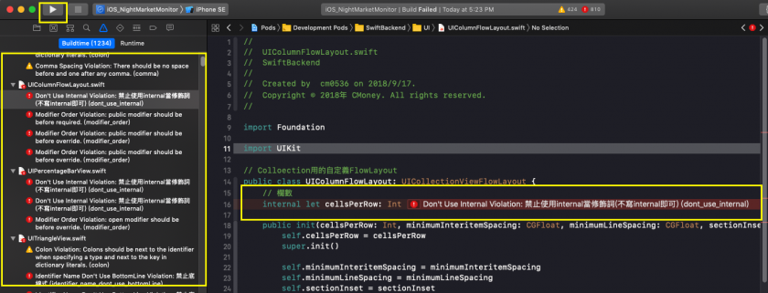

# 靜態檢查器

## **目標**

* 統一 code style
* 解決因手動進行檢查造成的耗時以及低效率

## **什麼是 SwiftLint ??**

[SwiftLint](https://github.com/realm/SwiftLint)是[realm](https://realm.io/)公司出的一款CodingStyle靜態檢查器，選用此工具原因是目前熱門獨大且唯一持續更新。

### 安裝方法

* 第一步：設定PodFile，並且pod install
  * 開啟專案內的PodFile裡加入下面程式碼

```text
pod 'SwiftLint'
```

* 第二步：設定Build Phases
  * 開啟專案內設定Build Phases &gt; 按 “＋” &gt; RunScript &gt; 輸入下方腳本

```text
"${PODS_ROOT}/SwiftLint/swiftlint" lint --config "${SRCROOT}/swiftlint.yml"
```

* 第三步：放入規則設定檔
  * 放在專案的根目錄，叫做"swiftlint.yml"



### **執行方法**

直接按下編譯即可！！會直接顯示成黃色警告和紅色錯誤！！



### **禁用規則**

```text
// swiftlint:disable colon
let noWarning :String = "" // 我被跳過了
// swiftlint:enable colon
let hasWarning :String = "" // 我被禁止了
```

### **規則清單**

[SwiftLint/Rules.md連結](https://realm.github.io/SwiftLint/rule-directory.html)

### **參考網站**

* [SwiftLint Git](https://github.com/realm/SwiftLint)
* [SwiftLint，规范代码，成为完美的偏执患者](https://www.jianshu.com/p/40aa8695503f)
* [SwiftLint使用](https://www.zybuluo.com/Sweetfish/note/1028669)

## **其他工具**

* tailor：另一套靜態檢查器\([Git連結](https://github.com/sleekbyte/tailor)\)

  但有個嚴重問題，目前只支援到Swift3.0，無人更新...

* SwiftFormat：強制格式化的工具\([Git連結](https://github.com/nicklockwood/SwiftFormat)\)

  尚未深入研究，但能設定的條件不夠多。

