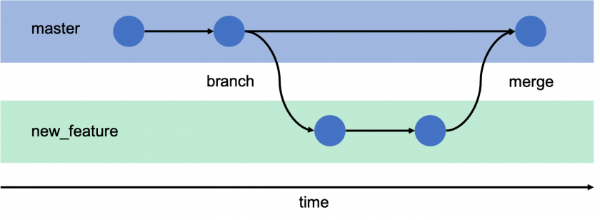
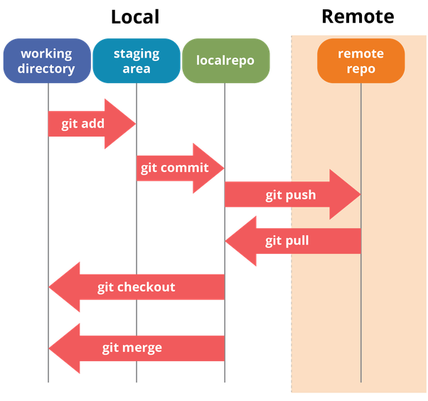

# Git 使用方法

## 如何使用Git?

* 第一點: 分支的概念
  * master: 程式碼紀錄的主幹
  * branch: 當要開發新功能或是緊急修復，會開一個分支進行開發
  * merge: 新功能或是緊急修復完成後，需要合併回主幹，讓主幹也有新功能

* 第二點: 程式碼的操作
  * clone: 下載整份Repo到本機
  * add: 加入更動到暫存區
  * commit: 記錄在本機
  * push: 推送到遠端
  * pull: 拉取遠端的紀錄
  * checkout: 切換分支
  * merge: 合併分支

