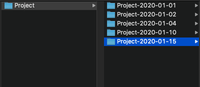
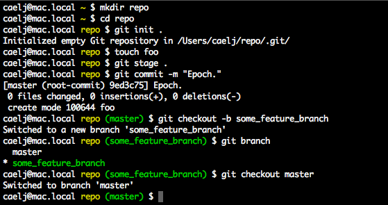
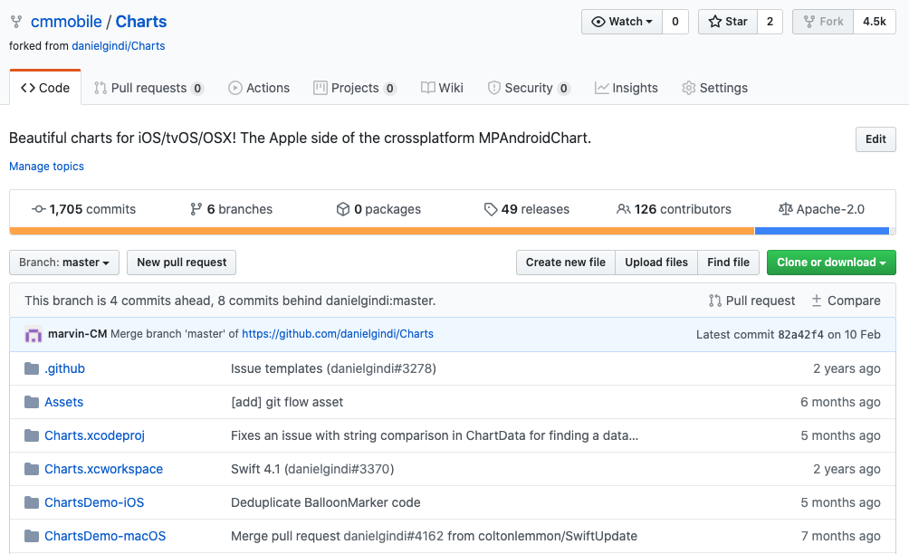
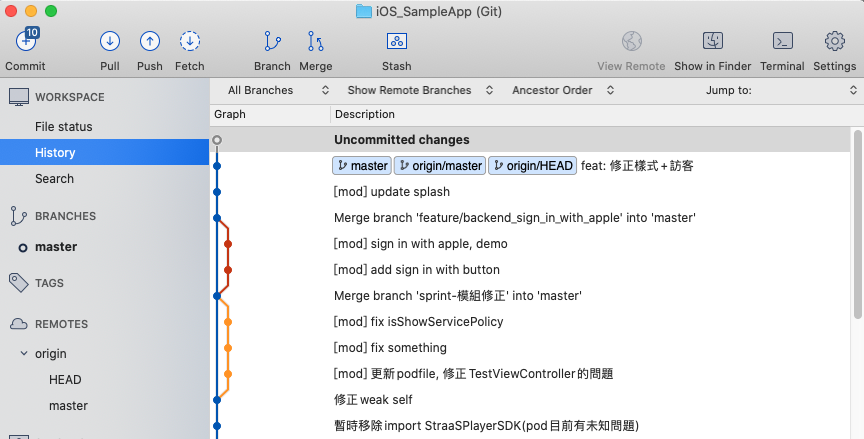

# Git 基本知識

## 開發程式版本控制的困擾??

## 什麼是 Git ?

* Git 是一種"版本控制系統"
* 簡單的說，Git 就像玩遊戲的時候可以儲存進度一樣。舉例來說，為了避免打頭目打輸了而損失裝備，又或是打倒頭目卻沒有掉落期望的珍貴裝備，你也許在每次要去打頭目之前之前記錄一下，在發生狀況的時候可以載入舊進度，再來挑戰一次。

## 什麼是 GitHub ?  什麼是 GitLab ? 什麼是 SourceTree ?

* Git 原本是基於終端機的版控系統，原本需要用終端機操作，但實在不易閱讀和操作，導致有很多GUI介面的網站或是應用程式用來補助。
* GitHub 是基於 Git 進行版本控制的軟體原始碼代管服務平台，重視程式碼協作與社群互動，是目前世界最大程式碼庫、開源社群。
* GitLab 是基於 Git 的完全整合的軟體開發平台，重視軟體的開發流程與整合，因此有 GitLab CI/CD 和 Runner，並且可架設私有 GitLab。
* SourceTree 是用來本機開發 Git Repository 的應用程式，可以不需要輸入指令，只要簡單操作就可以達到版本控制的操作。

