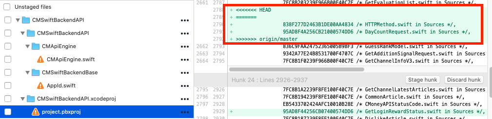
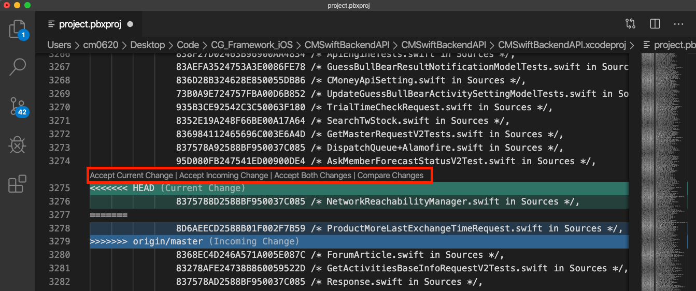
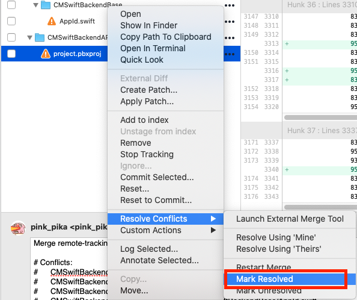

# Git 篇

### 目前 iOS 小組操作 Git 主要是用以下四個工具

* SourceTree：用於 Commit、Push、Branch 的新增切換刪除、Merge
* Visual Studio Code：用於解衝突，可清楚顯示衝突後的差異，可點選按鈕選擇處理策略
* Xcode：用於解衝突，可直接編譯測試
* GitLab：多人協作的專案和模組會使用此工具發動 Merge Request

### 解衝突步驟

#### 第一步：當 Merge 後修改到相同程式碼位置時，會發生衝突


#### 在 SourceTree 上會顯示上圖，衝突的檔案前方會有橘色驚嘆號，並且檔案內帶有&lt;&lt;&lt;HEAD ==== &gt;&gt;&gt; 等符號



#### 通常有三種衝突，通常優先處理"專案檔衝突"，不能開啟專案也不能測試ＱＱ

* 專案檔\(.xcodeproj\)衝突
* 程式碼\(.swift\)衝突
* 資源檔\(.png....\)衝突


#### 第二步：開啟 Visual Studio Code，使用它來處理衝突


* Current Change  代表自己本地的改變 \(自己寫的\)
* Incoming Change 代表合併進來的改變 \(別人寫的\)



可以點擊以下四種操作或是加上手動修正，來處理衝突

* Accept Current Change 將會直接使用"自己本地的改變"
* Accept Incoming Change 將會直接使用"合併進來的改變"
* Accept Both Changes 兩者都保留
* Compare Changes 可以用於進階比較每行差異\(較少使用\)


#### 第三步：使用 Xcode 確認可以編譯成功，或是再次修正!!!

#### 第四步：回到 SourceTree ，對檔案點擊右鍵，選擇 Resolve Conflicts &gt; Mark Resolved

