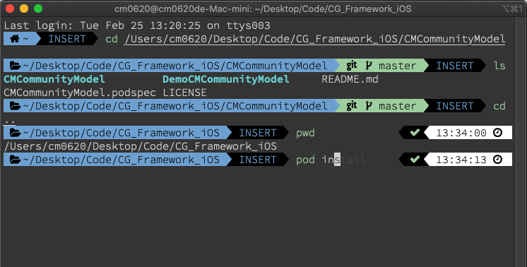
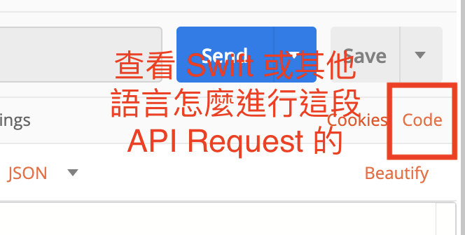

# 基本工具篇

## **終端機的優化**

* iTerm2安裝 - [Link](https://iterm2.com/)
* 基本語法

  ```text
  #查看是哪種shell 
  echo $0
  #列出有哪些shell
  cat /etc/shells   
  #切換shell
  chsh -s /bin/bash
  chsh -s /bin/zsh
  chsh -s /bin/fish
  ```

* ZSH安裝
  * [超簡單！十分鐘打造漂亮又好用的 zsh command line 環境](https://medium.com/statementdog-engineering/prettify-your-zsh-command-line-prompt-3ca2acc967f)
  * [為 MAC 的 Terminal 上色 - 透過 iTerm 2 和 Oh My Zsh 高亮你的終端機](https://pjchender.blogspot.com/2017/02/mac-terminal-iterm-2-oh-my-zsh.html)
  * [zsh-syntax-highlighting](https://github.com/zsh-users/zsh-syntax-highlighting/blob/master/INSTALL.md)
  * 最後 iTerm2 + ColorScheme + zsh + powerline font + oh-my-zsh + powerlevel9k + highlighting



## **Mac 相關**

* **Mac 中已內含的 script \(10.14 以前, 10.15 以後要自己裝\)**
  * ruby
  * python \(py2, py3 要自已另外裝\)
  * swift
  * c & c++
* **Mac 中好用的套件管理工具**
  * Homebrew [網址](https://brew.sh/index_zh-tw)
* **Mac 檔案目錄結**
  * [參考資料 Mac 電腦入門特輯：檔案管理大不同！（一）Finder 基礎操作與檔案結構](https://www.cool3c.com/article/93894)


## **Terminal 基本指令**

* pwd \(找出自己在哪裡\)
* cd xxx 往該資料夾走
* cd .. 往上一層走
* ls \(列出該處下面的資料夾和檔案\)
* ls -a \(同上，但包含隱藏檔\)
* touch xxx \(直接創造一個檔\)
* vim xxx \(編輯該檔\)
  * i : 開始編輯
  * esc : 結束編輯
  * esc, :q 在 vim 內跳出不儲存
  * esc, :wq 在 vim 內儲存後跳出
* rm -rf xxx \(砍掉該檔。!注意，在按下 return 之前，先確定自己在哪\)

## XCode 基本使用

* 介面簡略介紹
* 瘦身Xcode-[Link](https://medium.com/%E5%BD%BC%E5%BE%97%E6%BD%98%E7%9A%84-swift-ios-app-%E9%96%8B%E7%99%BC%E6%95%99%E5%AE%A4/%E5%88%AA%E9%99%A4xcode%E4%BD%94%E6%93%9A%E7%A1%AC%E7%A2%9F%E5%A4%A7%E9%87%8F%E7%A9%BA%E9%96%93%E7%9A%84derived-data-190c85eba79)
* 開源的 Xcode cleaner - [Link](https://github.com/waylybaye/XcodeCleaner)
* Xcode左右邊介面區
* 新增或編譯設定檔\(Scheme\)
* 風格設定-[Link](https://github.com/hdoria/xcode-themes)
* 快捷鍵\(cmd=windows, option=alt\)
  * 多行註解\(cmd+/\)
  * 生成註解\(cmd+option+/\)
  * 收合註解\(ctrl+shift+cmd+左右\)
  * 收合方法\(shift+cmd+option+左右\)
  * 跳至定義\(cmd+右鍵\)
  * 分視窗跳至定義\(option+右鍵\)
  * 分視窗開檔案\(option+左鍵點檔案\)
* 偵錯相關
  * print記得要用\#if DEBUG和\#endif
  * Console區\(指令:help/po\), expression 注入, layout constraint error
  * 中斷點的使用
  * view 的 debug \(11.4 以後有加強\)
  * Git blame \(author\)
  * Caller & Callee

## Postman 使用 \(API 工具\)

基本畫面如下


公司內部一般會給 SWAG，但你可能有某些參數想要測試，或是你想要調整送出的方法，這時候你可以快速的用 Postman 進行測試。

#### 測試各種不同的 header


#### 測試各種不同的 body，你也可以在這測不同的 body encoding，新版的連 GraphQL 也可以測


#### 使用 Postman 的 Code gen 功能，去看不同語言進行 API 的方法\(因為是自動生成，有很多不必要的程式碼，記得砍掉不需要用到的\)



按下 Code 之後，你可以看到下方的 Swift 範例

```text
import Foundation

var semaphore = DispatchSemaphore (value: 0)

var request = URLRequest(url: URL(string: "https://rss.itunes.apple.com/api/v1/tw/ios-apps/top-free/all/3/explicit.json")!,timeoutInterval: Double.infinity)
request.httpMethod = "GET"

let task = URLSession.shared.dataTask(with: request) { data, response, error in 
  guard let data = data else {
    print(String(describing: error))
    return
  }
  print(String(data: data, encoding: .utf8)!)
  semaphore.signal()
}

task.resume()
semaphore.wait()

```

**當然，其他語言也有**


## **Visual Studio Code \(選用\)**

