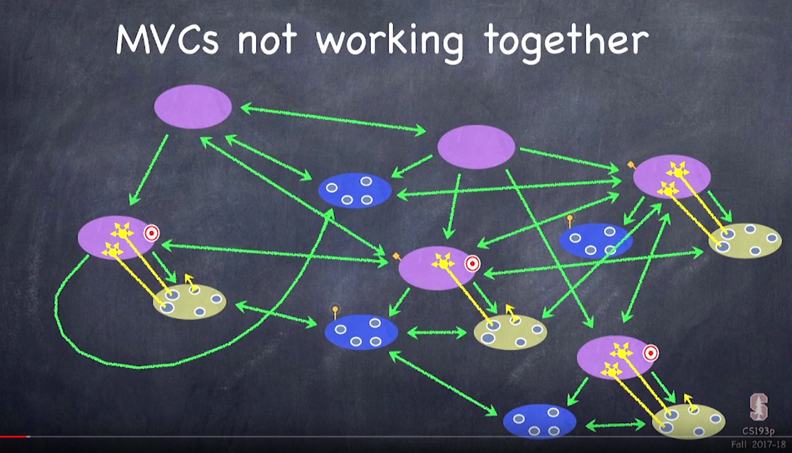
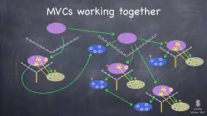

# MVC

## **MVX 家族**

現在主流的 iOS App 架構，都可以規類在 MVX，最早應可追溯至 MVC 架構。在 App 日益複雜的演進下，開始切出其他相對應職責的類別。

以跨平台為目的的 App，從不一定使用 MVX 系列。有可能會使用其他大公司定出的架構，也有可能發展出自己的架構。如 Redux 的 One way data flow \(後來也被引入 SwiftUI 中\)，或是 Uber 提出的 RIBs 等。

## MVC - 一切的原型

當你和另一個開發者談 MVC之前，請先確認雙方講的是不是同一個 MVC。

下圖的架構是 iOS 的 MVC

#### 下圖的架構是 iOS 的 MVC

### **下圖的架構是 iOS 的 MVC**

如果你的 App 發生下面這樣的資料流動，可能 MVC 的架構就是沒有照 Apple 的規範所設計。

## MVP - Model-View-Presenter

Todo - 把資料補完

## MVVM - Model-View-ViewModel

Todo - 把資料補完

## MVVM-C - Model-View-ViewModel-Cordinator

Todo - 把資料補完

## VIPER - View-Interactor-Presenter-Entity-Router

聽說 Agoda 是用這個架構

Todo - 把資料補完

##  參考資料

* **架構MVC**
  * [蘋果官方的 MVC 架構介紹](https://developer.apple.com/library/archive/documentation/General/Conceptual/DevPedia-CocoaCore/MVC.html)
  * [Ray Wenderlich 的 MVC 架構介紹](https://www.raywenderlich.com/1073-model-view-controller-mvc-in-ios-a-modern-approach)
  * [iOS 各種架構](https://medium.com/ios-os-x-development/ios-architecture-patterns-ecba4c38de52)
  * [The only viable iOS architecture](https://medium.com/flawless-app-stories/the-only-viable-ios-architecture-c42f7b4c845d)
* **推薦影片**
  * [iPlayground 2019 \| 漫談 iOS 架構：MVC / MVVM / VIPER 與 Redux](https://www.youtube.com/watch?v=qDyb6AkX0s0)
  * [iPlayground 2019 \| 從MVC到MVVM，再到MVVMC的開發經驗分享](https://www.youtube.com/watch?v=0GQXVfahdI4)
* 其他架構
  * [Uber/RIBs](https://github.com/uber/RIBs)
  * [SwiftUI data flow - Redux](https://developer.apple.com/documentation/swiftui/state-and-data-flow)

