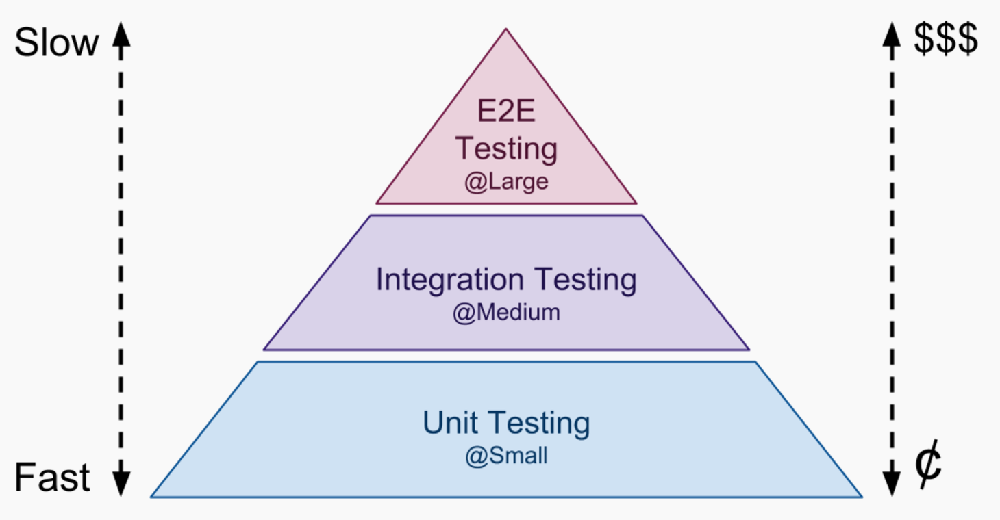

# 單元測試的基本概念

## 單元測試是什麼

單元測試就是一段自動化的程式碼，這段程式會呼叫被測試的工作單元，之後對這個單元的結果進行驗證。

```swift
func testToolIsNumberTrue() throws {
    
    let tool = Tool()
    let result = tool.isNumber(input: "1")
    XCTAssert(result)
}
```

## **單元測試的三步驟**

1. Arrange：準備
2. Act：操作
3. Assert：驗證

## 單元測試的特質

1. 自動化且可被重複執行的
2. 容易實作的
3. 容易執行的 \(隨便按個鈕就可以\)
4. 非臨時性的 \(這個測試到第二天第三天仍有意義，並可以執行\)
5. 執行速度很快的
6. 執行結果一致的
7. 完全獨立的 \(不依賴其他因素或測試\)
8. 測試目標清楚的 \(發生錯誤可以明確知道哪裡有問題\)

## 整合測試

```swift
func testDataManagerGetData() throws {

    let dataManager = DataManager()
    dataManager.getData { // ---> 假設此方法呼叫了Api
        result in
        switch result{
        case .success(_):
            XCTAssert(true)
        case .failure(_):
            XCTAssert(false)
        }
    }
}
```

* 假設你的測試有不符合上面單元測試的特質，很有可能你的是屬於"整合測試"
* 可能的原因像是有不確定的變因\(例如系統時間、網路狀態\)、用到了真實的檔案系統或資料庫
* 整合測試有必要，但有個問題就是一次測試太多東西，無法確定到底誰壞了

## **總結**

* 整合測試：會用到真實的相依物件和資源
* 單元測試：把要測試的物件與其他相依物件隔離開來，以確保穩定與快速

## 推薦書單

單元測試的藝術\(The Art of Unit Testing\) - \([https://www.tenlong.com.tw/products/9789864342471?list\_name=srh](https://www.tenlong.com.tw/products/9789864342471?list_name=srh)\)

* 第1章：單元測試定義
* 第8章：好的單元測試
* 第11章：如何讓程式變可測試

##  寫好單元測試就好了嗎？


## 測試金字塔 \(testing pyramid\)



