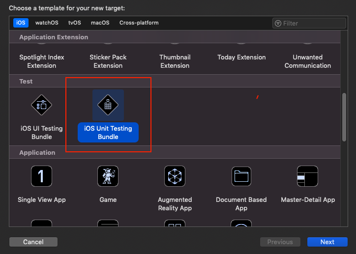
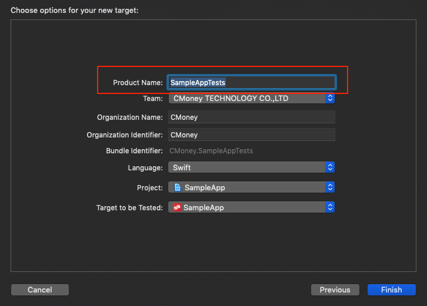
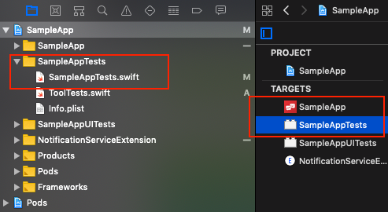
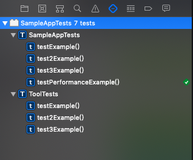
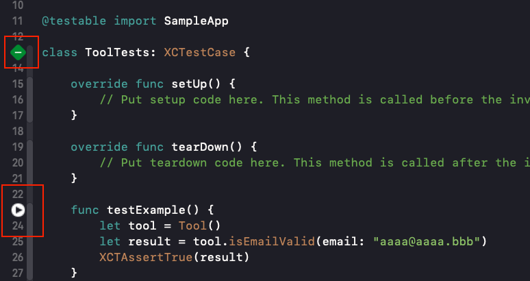
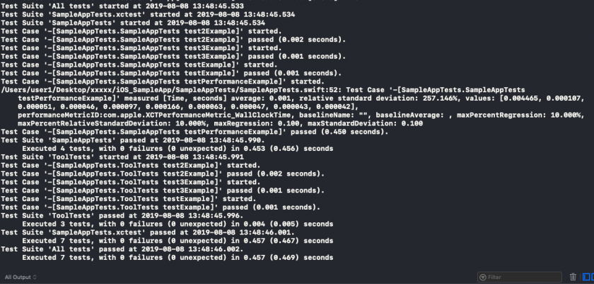
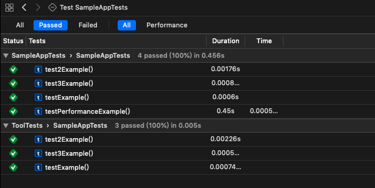
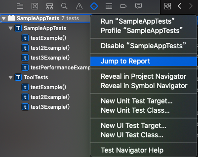
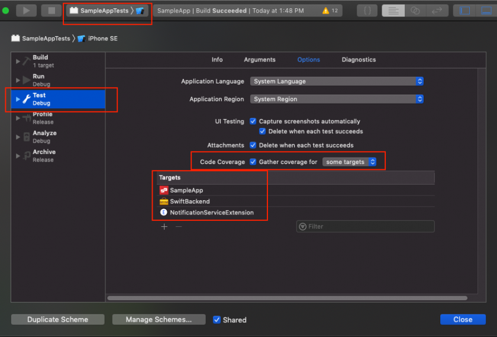
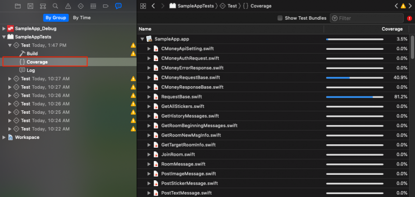

# XCTest-UnitTest

## **XCTest 和 Unit Testing Bundle**

* **XCTest：是用來建立unit tests, performance tests, UI tests的Framework**
* **Unit Testing Bundle：Xcode內建用來做單元測試的Target**

## **如何安裝**







## **如何撰寫測試**

* setUp\(\) 和 tearDown\(\) 在每個測試方法的前後都會執行，可以做一些統一初始化的動作或是清掉狀態等動作
* 在這個類別中定義的測試方法，名稱需要以「test開頭」，並且「不返回內容」，才可執行

```swift
class SampleAppTests: XCTestCase {

/// 每個測試執行前會呼叫
override func setUp() {
    // Put setup code here. This method is called before the invocation of each test method in the class.
}

/// 每個測試執行後會呼叫
override func tearDown() {
    // Put teardown code here. This method is called after the invocation of each test method in the class.
}

//是否為有效信箱 - 成功
func testToolIsEmailValidSuccess() {
    let tool = Tool()
    let result = tool.isEmailValid(email: "aaaa@aaaa.bbb")
    XCTAssertTrue(result)
}

//是否為有效密碼 - 失敗
func testToolIsEmailValidFail() {
	let tool = Tool()
    let result = tool.isPasswordValid(password: "aaaaaa")
    XCTAssertTrue(result)
}

// 計算效能
func testPerformanceExample() {
    self.measure {
        let tool = Tool()
        _ = tool.isEmailValid(email: "aaaa@aaaa.bbb")
    }
}
```

## 如何把程式寫成可測試

* 乾淨的架構 \( 請詳見 MVC 、 MVVM 等等架構 \)
* 職責單一的物件
* 抽離檔案系統、資料庫、遠端資料

對 Model 測試


對 ViewModel 或是 Manager 測試

## **如何執行**





## **如何看測試結果：**







## **如何使用測試覆蓋率**





