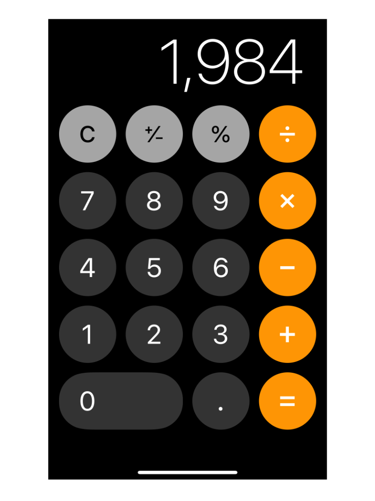

# 計算機考題



### if else 的寫法

```text
func execute(input: String){
    if input == "A"{
        // 做A事情
    } else if input == "B"{
        // 做B事情
    }
}
```

### 繼承與多型的寫法

```text
class Base{
    func doSomething(){}
}

class A: Base{
    override func doSomething(){
        // 做A事情
    }
}

class B: Base{
    override func doSomething(){
        // 做B事情
    }
}

func execute(base: Base){
    base.doSomething()
}
```

## 計算機考題：

請不要使用if else來實作簡單的計算機

* 先實作簡單輸入\(ex. 1+2=3\)
* 先不考慮先乘除後加減的案例
* 考慮多位數輸入\(ex. 12+35=47\)
* 考慮連續輸入\(ex. 1+2+3+4=10\)
* 考慮取代輸入\(ex. 先輸入1+，再輸入-，變成1-\)

## 延伸議題：

先乘除後加減需要兩步驟 -  [參考資料Link](http://www2.lssh.tp.edu.tw/~hlf/class-1/lang-c/stack2.htm)

1. 計算式把中序轉後序
2. 把後序的運算符號放入Stack裡計算即可


